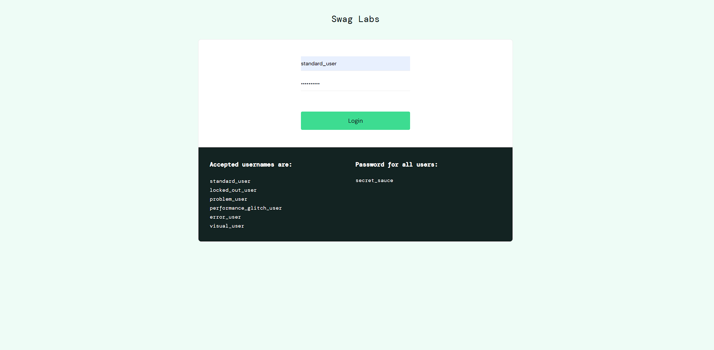
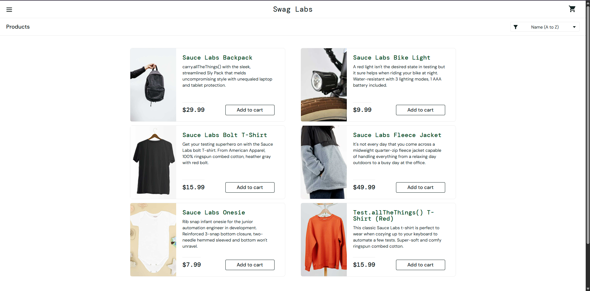
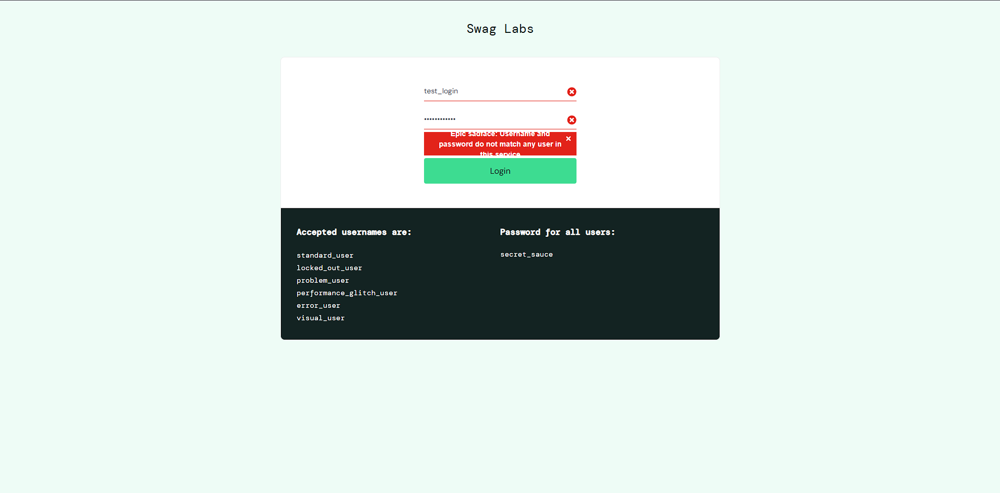

## Positive Test-Case.

ID: №1.

Кейс: Успешная авторизация на сайте [saucedemo](https://www.saucedemo.com/)

Подусловия: 
1. Зайти на сайт [saucedemo](https://www.saucedemo.com/)

Шаги:
1. Вводим корректный логин (standard_user);
2. Вводим корректный пароль (secret_sauce);
3. Нажимаем Login.

Ожидаемый результат: после клика на кнопку "Login" авторизация проходит успешно и пользователь попадает на страницу с товарами.

Актуальный результат: после ввода валидных данных (login: standard_user; password: secret_sauce) пользователь попадает на страницу с выбором товаров.

Статус: Passed.

Приложения: 

## Negative Test-Case.

ID: №2.

Кейс: Авторизация на сайте [saucedemo](https://www.saucedemo.com/) используя невалидный логин.

Подусловия:
1. Зайти на сайт [saucedemo](https://www.saucedemo.com/)

Шаги:
1. Вводим некорректный логин (test_login);
2. Вводим корректный пароль (secret_sauce);
3. Нажимаем Login.

Ожидаемый результат: после клика на кнопку "Login" должна выйти ошибка о том, что данного пользователя не существует.

Актуальный результат: после ввода невалидного логина (test_login) и корректного пароля (secret_sauce) мы не попадаем на страницу с товарами и появляется ошибка: "Epic sadface: username and password do not match any user in this service.". 

Статус: Passed

Приложения: 

